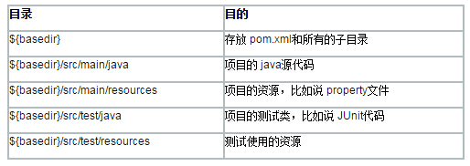
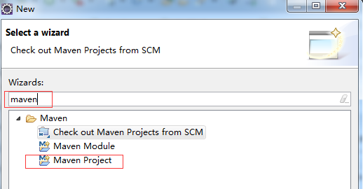
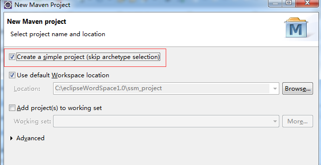
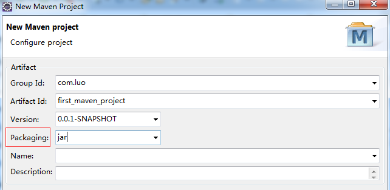
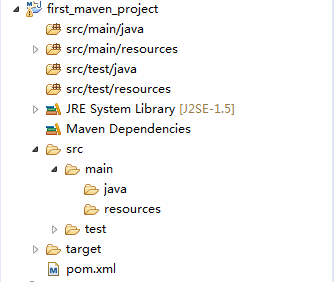

###Maven使用教程
####Maven项目默认约定

编译后 的 classes 会放在 basedir/target/classes 下面， JAR 文件会放在 ${basedir}/target 

###Maven安装与配置
1. 下载maven安装包 [apache-maven-3.2.1](http://download.csdn.net/detail/u013142781/9355367)
2. maven环境变量配置 MAVEN_HOME PATH `%MAVEN_HOME%\bin;`
3. 设置apache-maven-3.2.1\conf\setting.xml文件 配置本地仓库 localRepository的值设置成你本地仓库的路径

###eclipse mavenr插件配置
1. 下载[eclipse-maven3-plugin](http://download.csdn.net/detail/u013142781/9355661)
2. 插件安装完成后 Windows–>Prefrences–>Installations–>Add。installation name选maven的根目录

###Maven的常用命令
    1. 创建Maven的普通java项目： 
    mvn archetype:create -DgroupId=packageName -DartifactId=projectName 
    2. 创建Maven的Web项目： 
    mvn archetype:create -DgroupId=packageName -DartifactId=webappName-DarchetypeArtifactId=maven-archetype-webapp 
    3. 编译源代码： mvn compile 
    4. 编译测试代码：mvn test-compile 
    5. 运行测试：mvn test 
    6. 产生site：mvn site 
    7. 打包：mvn package 
    8. 在本地Repository中安装jar：mvn install 
    9. 清除产生的项目：mvn clean 
    10. 生成eclipse项目：mvn eclipse:eclipse 
    11. 生成idea项目：mvn idea:idea 
    12. 组合使用goal命令，如只打包不测试：mvn -Dtest package 
    13. 编译测试的内容：mvn test-compile 
    14. 只打jar包: mvn jar:jar 
    15. 只测试而不编译，也不测试编译：mvn test -skipping compile -skipping test-compile 
    ( -skipping 的灵活运用，当然也可以用于其他组合命令) 
    16. 清除eclipse的一些系统设置:mvn eclipse:clean
###Maven工程创建

  

######输出项目名，包（Packaging，如果只是普通的项目，选jar就好了，如果是web项目就选war，这里我们选择jar）  

######现在我们添加mysql驱动包的依赖,编辑pom.xml如下：
    <project xmlns="http://maven.apache.org/POM/4.0.0" xmlns:xsi="http://www.w3.org/2001/XMLSchema-instance" xsi:schemaLocation="http://maven.apache.org/POM/4.0.0 http://maven.apache.org/xsd/maven-4.0.0.xsd">
      <modelVersion>4.0.0</modelVersion>
      <groupId>com.luo</groupId>
      <artifactId>first_maven_project</artifactId>
      <version>0.0.1-SNAPSHOT</version>
    
      <dependencies>
    <!-- mysql驱动包 -->
    <dependency>
    <groupId>mysql</groupId>
    <artifactId>mysql-connector-java</artifactId>
    <version>5.1.29</version>
    </dependency>
    </dependencies>    
    </project>

######对应依赖的包的dependency 可以在这个网站找[http://mvnrepository.com/](http://mvnrepository.com/)